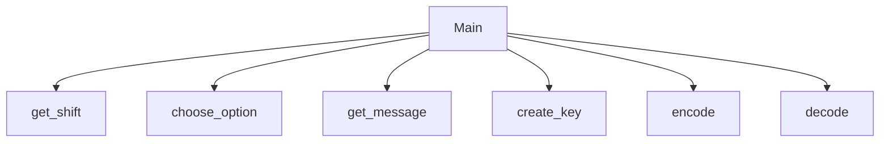

# Chapter-9-Team-project
Jamie Duty, Braxton Hartley

## <Chapter 9 team thing> It will encrypt and decrpyt messages
You will input a number to determine the shift of the code to the alphabet and then use that for the 
decryption as well

### <Chapter 9 team thing> Flowchart

#### Function Diagrams

| `Main()`    |    author Braxton           |
| ------------------ | ------------- |
| `The main driving force that puts it togethor`    | It's like the brain of the operation  |
***
| `get_shift()`    |               |     author   |
| ------------------ | ------------- | ------------ |
| `argument:type`    | takes input from the user for ____  |              |
| `time:integer`     | calculates ______  | outputs ____             |
| `name:string`      | takes input for name ___ | returns total |
***
| `choose_option()`    |               |     author   |
| ------------------ | ------------- | ------------ |
| `argument:type`    | takes input from the user for ____  |              |
| `time:integer`     | calculates ______  | outputs ____             |
| `name:string`      | takes input for name ___ | returns total |
***
| `get_message()`    |               |     author   |
| ------------------ | ------------- | ------------ |
| `argument:type`    | takes input from the user for ____  |              |
| `time:integer`     | calculates ______  | outputs ____             |
| `name:string`      | takes input for name ___ | returns total |
***
| `create_key(shift)`    |               |     author Braxton  |
| ------------------ | ------------- | ------------ |
| `Accepts shift value`    | changes the accepted shift into a key list | returns key values             |
***
| `encode(message, key)`    |               |     author   |
| ------------------ | ------------- | ------------ |
| `argument:type`    | takes input from the user for ____  |              |
| `time:integer`     | calculates ______  | outputs ____             |
| `name:string`      | takes input for name ___ | returns total |
***
| `decode(message, key)`    |               |     author  Braxton |
| ------------------ | ------------- | ------------ |
| `Accepts message and key values`    | takes the encrypted message and decodes it  | prints decoded message             |
***
